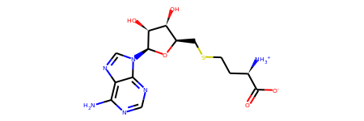

## Minimisation

```python
from rdkit import Chem
Chem.MolFromSmiles('c1nc(c2c(n1)n(cn2)[C@H]3[C@@H]([C@@H]([C@H](O3)CSCC[C@@H](C(=O)[O-])[NH3+])O)O)N')
```


```python
from rdkit_to_params import Params
# PDB Smiles: 'c1nc(c2c(n1)n(cn2)[C@H]3[C@@H]([C@@H]([C@H](O3)CSCC[C@@H](C(=O)O)N)O)O)N'
# corrected: 'c1nc(c2c(n1)n(cn2)[C@H]3[C@@H]([C@@H]([C@H](O3)CSCC[C@@H](C(=O)[O-])[NH3+])O)O)N'
p = Params.from_smiles_w_pdbfile(pdb_file='swiss.pdb',
                             smiles='c1nc(c2c(n1)n(cn2)[C@H]3[C@@H]([C@@H]([C@H](O3)CSCC[C@@H](C(=O)[O-])[NH3+])O)O)N',
                            name='SAH')
p.dump('SAH.params')
```

```python
import pyrosetta
from pyrosetta_help.init_ops import make_option_string, configure_logger

logger = configure_logger()
pyrosetta.distributed.maybe_init(extra_options=make_option_string(no_optH=False,
                                                ex1=None,
                                                ex2=None,
                                                #mute='all',
                                                ignore_unrecognized_res=True,
                                                load_PDB_components=False,
                                                ignore_waters=False)
                               )
```

```python
from pyrosetta_help.common_ops import pose_from_file

pose = pose_from_file('swiss.pdb', params_filenames=['SAH.params'])
metal_setup = pyrosetta.rosetta.protocols.simple_moves.SetupMetalsMover()
metal_setup.set_remove_hydrogens(True)  # default
metal_sele = pyrosetta.rosetta.core.select.residue_selector.ResiduePropertySelector(pyrosetta.rosetta.core.chemical.ResidueProperty.METAL)
metal_setup.set_metal_selector(metal_sele)
metal_setup.apply(pose)
scorefxn = pyrosetta.get_fa_scorefxn()
stm = pyrosetta.rosetta.core.scoring.ScoreTypeManager()
stm.score_type_from_name('metalbinding_constraint')
scorefxn.set_weight(stm.score_type_from_name('metalbinding_constraint'), 1)
```

To prevent Swissmodel blow-ups, a first dihedral relax with fixed backbones.

```python
movemap = pyrosetta.MoveMap()
movemap.set_bb(False)
movemap.set_chi(True)
movemap.set_jump(True)
relax = pyrosetta.rosetta.protocols.relax.FastRelax(scorefxn, 3)
relax.set_movemap(movemap)
relax.apply(pose)
```

Then with free backbones

```python
movemap = pyrosetta.MoveMap()
movemap.set_bb(True)
movemap.set_chi(True)
movemap.set_jump(True)
relax = pyrosetta.rosetta.protocols.relax.FastRelax(scorefxn, 3)
relax.set_movemap(movemap)
relax.apply(pose)
```

Then cartesian

```python
cscorefxn = pyrosetta.create_score_function('ref2015_cart')
cscorefxn.set_weight(stm.score_type_from_name('metalbinding_constraint'), 1)
relax = pyrosetta.rosetta.protocols.relax.FastRelax(cscorefxn, 5)
relax.cartesian(True)
relax.minimize_bond_lengths(True)
relax.minimize_bond_angles(True)
relax.apply(pose)
```

Then a final regular relax

```python
relax = pyrosetta.rosetta.protocols.relax.FastRelax(scorefxn, 5)
relax.apply(pose)
```

For the opt_nov2016_cart model and additional step was done:

```python
pyrosetta.rosetta.basic.options.set_boolean_option('corrections:beta_nov16', True)
cscorefxn = pyrosetta.create_score_function('beta_nov16_cart')
cscorefxn.set_weight(stm.score_type_from_name('metalbinding_constraint'), 1)
relax = pyrosetta.rosetta.protocols.relax.FastRelax(cscorefxn, 5)
relax.cartesian(True)
relax.minimize_bond_lengths(True)
relax.minimize_bond_angles(True)
print(relax.scorefxn().get_name())
relax.apply(pose)
pose.dump_pdb('model_cart_nov16.pdb')
```